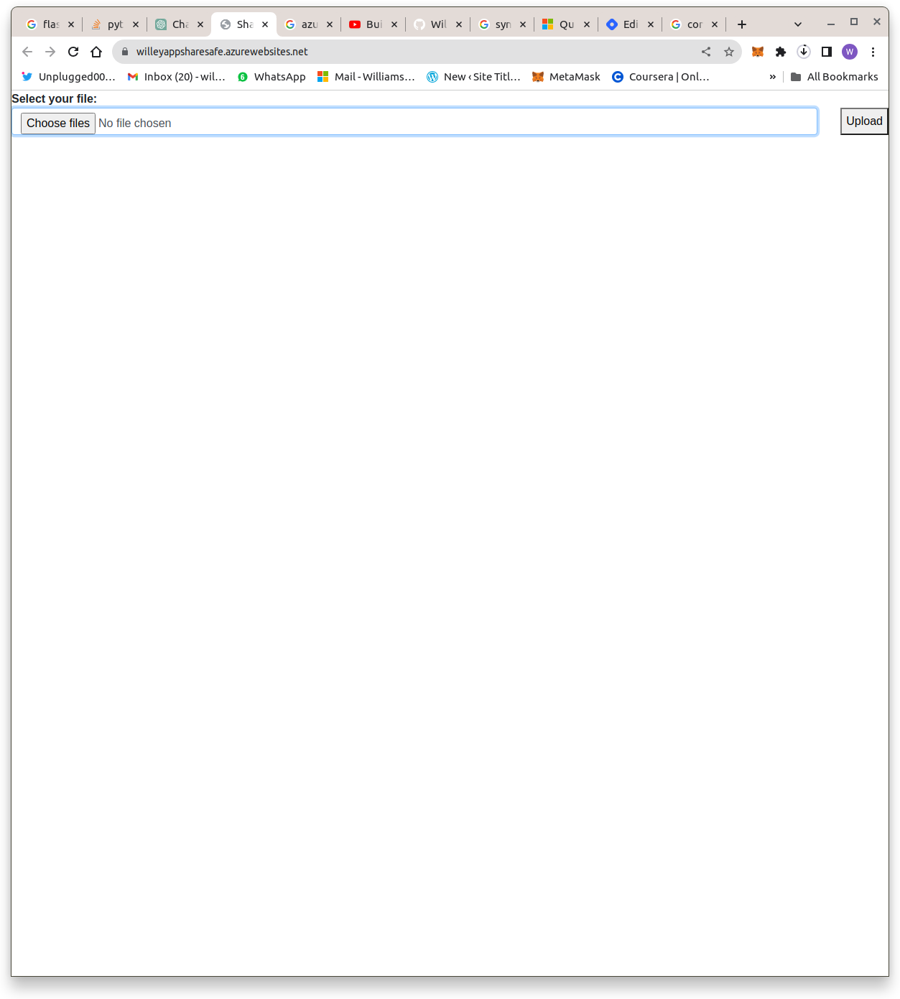
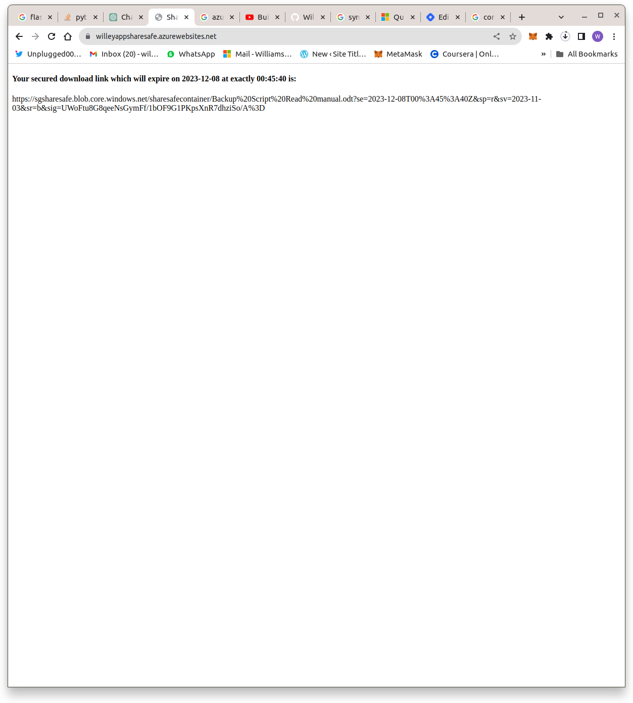

# Sharesafe
##### _Securely share files with trusted personnel_

Sharesafe is a web application which allows users to securely share files. Users can upload a file through the web-app. Once uploaded, the sharesafe application will generate a unique time-limited download link. This link authorizes download to the uploaded file for a specified duration

## Workflow

- The sharesafe web-app is hosted in azure
- The public endpoint of the app is used to launch the app
- The app securely uploads a file to azure blob storage 
- A time-bound download link is generated for the uploaded file

**Image showing app landing page**

**Image showing generated download link**

[Click here to try this application](https://willeyappsharesafe.azurewebsites.net/)

[Click here to learn how this project was developed](https://ochuwilliams.hashnode.dev/employee-onboard-automator-using-azure-logic-apps)
